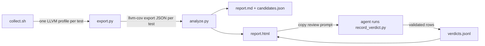

# dead-weight-tests

[](https://skills.sh/roberts-pumpurs/dead-weight-tests)
[](https://github.com/roberts-pumpurs/dead-weight-tests/actions/workflows/ci.yml)

An agent skill that finds Rust tests which add no coverage of their own: tests that run exactly the same code as another test, tests whose code is a strict subset of another test's, and near-identical pairs. LLM-written test suites collect these fast.

Coverage only finds suspects. Two tests can run the same lines and check different things, so the skill makes the agent read both tests before it recommends a cut.

## Install

```sh
npx skills add roberts-pumpurs/dead-weight-tests
```

Then ask your agent to "find dead weight tests". It follows [`SKILL.md`](skills/dead-weight-tests/SKILL.md).

Requirements in the target project: [`cargo-nextest`](https://nexte.st), [`cargo-llvm-cov`](https://github.com/taiki-e/cargo-llvm-cov), the `llvm-tools-preview` rustup component, and Python 3. The scripts use only the Python standard library.

## How it works



1. `collect.sh` turns on coverage instrumentation and runs nextest with a target runner. Nextest runs every test in its own process, and the runner gives each process its own profile directory. Subprocesses a test starts write to the same directory.
2. `export.py` merges each test's profiles and exports its covered LLVM regions.
3. `analyze.py` drops test code (every test runs its own body), groups regions that the same tests cover, and finds duplicate, subsumed, and near-duplicate tests. It writes a markdown report, a JSON candidate list, and a self-contained HTML report.
4. The HTML report shows a module treemap, a containment graph, the two tests of a pair side by side with source lines colored by which test runs them, and per-line test counts. Its "Copy review prompt" button hands chosen candidates to an agent, which records cut, merge, keep, or fix verdicts through `record_verdict.py`. The recorder checks each pair against `candidates.json` and appends valid rows to `verdicts.jsonl`. A fix verdict means the test's name promises a check its body never makes.

## Usage without an agent

```sh
cd your-workspace
path/to/skills/dead-weight-tests/scripts/collect.sh -- --workspace
python3 path/to/skills/dead-weight-tests/scripts/analyze.py target/coverage/per-test/tests \
  --out target/coverage/per-test/report.md \
  --json target/coverage/per-test/candidates.json \
  --html target/coverage/per-test/report.html
open target/coverage/per-test/report.html
```

## Development

```sh
python3 -m unittest discover -s tests          # analyzer and recorder unit tests
shellcheck skills/dead-weight-tests/scripts/*.sh
cd tests/fixture && ../../skills/dead-weight-tests/scripts/collect.sh -- --workspace   # end-to-end
```

`tests/fixture` is a small crate with planted dead weight: a duplicate, a subsumed test, and a test that reaches the library only through a subprocess. CI runs the whole pipeline on it and checks that all three show up.

Releases use [release-please](https://github.com/googleapis/release-please) and Conventional Commits. Merging the release PR tags the version, attaches a skill archive to the GitHub release, and installs the skill from GitHub with the skills CLI as a smoke test. skills.sh has no upload step: it lists public repositories from that install telemetry.

Branch rules for `main` live in [`.github/rulesets/main.json`](.github/rulesets/main.json): squash-merged PRs only, both CI jobs green, signed commits, no force pushes or deletion; repository admins can bypass. The `Rulesets` workflow applies the file when it changes. It needs a `RULESETS_TOKEN` secret, a fine-grained token for this repository with "Administration: Read and write".

## License

MIT
